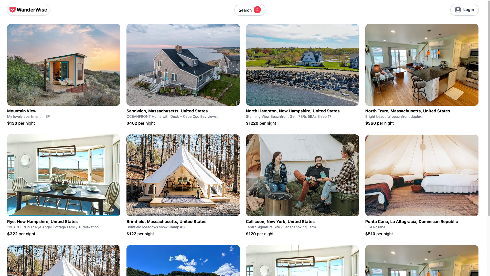

## Application is deployed here: https://master--roaring-lollipop-68e43f.netlify.app/login

This project is as part of submission for web development course. Project idea is similar to Airbnb.

# Wanderwise - An AirBnb clone website
## This is a project to practice React JS and built as part of final project for Web Development course. 
## It is essentially a clone of AirBnb where Hosts can list the properties and users can book it for a duration.
## This mostly focuses on UI skills

- https://rapidapi.com/apidojo/api/hotels4
- brew install vite
- brew install yarn
- yarn create vite client
- cd client
- yarn
- https://tailwindcss.com/docs/guides/vite
- yarn add tailwindcss postcss autoprefixer
- npx tailwindcss init -p
- yarn dev
- yarn add react-router-dom
- yarn add axios
- yarn add date-fns
- yarn add react-input-range
- yarn add react-image-gallery
- yarn add @heroicons/react@v1
- cd ../api
- yarn add express
- yarn add nodemon 
- yarn add cors
- yarn add mongoose
- yarn add dotenv
- yarn add bcryptjs
- yarn add jsonwebtoken
- yarn add cookie-parser
- yarn add image-downloader
- yarn add multer
- yarn add api --save
- yarn add axios
- yarn add @aws-sdk/client-s3